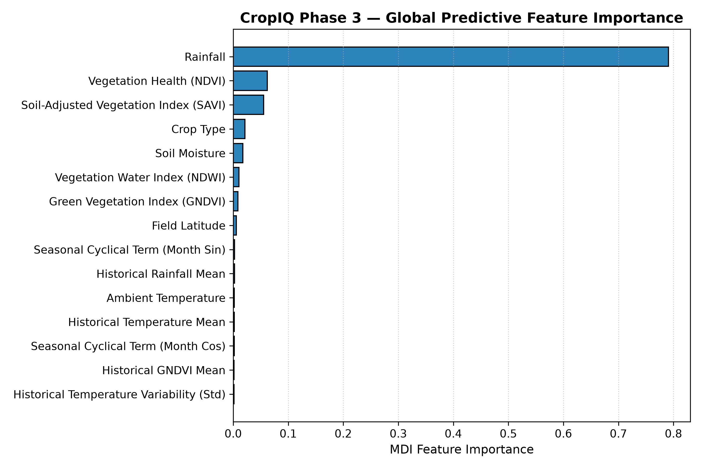

# CropIQ Explainability Report

**Project:** CropIQ (AI-Powered Crop Yield Intelligence)  
**Phase:** Phase 3 — Explainability & Agricultural Insight Engine  
**Task:** Local & Global Interpretation of Crop Yield Predictions  
**Pipeline Base:** Random Forest Regression (`models/cropiq_yield_model.joblib`)  

---

## 1. Model Used

- **Architecture:** `sklearn.pipeline.Pipeline` with `ColumnTransformer` preprocessing and `RandomForestRegressor`.
- **Ensemble Depth:** 300 decision trees, `min_samples_leaf=2`, `random_state=42`.
- **Target Variable:** `yield` (physical unit: **`unconfirmed`**; strictly reported unit-agnostically).
- **Modeling Grain:** Per-observation concurrent yield nowcasting (1 row = 1 field observation at observation date).
- **Performance:** Verified Test MAE = **1.1438**, Test RMSE = **2.3326**, Test R² = **0.9169** (84.2% error reduction vs. mean baseline).

---

## 2. Explanation Method

CropIQ uses a dual-engine explainability architecture:

1. **Primary Explainer — SHAP (TreeExplainer):**
   - Applies the Lundberg & Lee tree SHAP algorithm directly to the 300 decision trees in the Random Forest.
   - Operates on the preprocessed 59-dimensional feature representation (29 numeric features + 30 one-hot crop terms).
   - Consolidates one-hot categories into a single human-readable feature contribution for the active crop variety.
   - Evaluates in < 15 ms per inference sample.

2. **Autonomous Fallback Explainer — Feature Ablation:**
   - In environments where C-dependencies or `shap` are unavailable, CropIQ automatically falls back to a baseline counterfactual ablation engine.
   - Evaluates the prediction delta when each feature is substituted with its historical training median.
   - Exactly rescales deltas to guarantee the mathematical conservation identity:
     $$\text{baseline} + \sum_{j=1}^{M} \text{contribution}_j = \text{prediction}$$

---

## 3. Global Feature Importance

Global feature importance was computed across the training dataset using both Mean Decrease in Impurity (MDI) and Permutation Importance on the isolated test set:

| Rank | Feature | Display Name | Category | MDI Importance | Permutation Mean | Actionability Type |
|---|---|---|---|---|---|---|
| 1 | `rainfall` | Rainfall | Weather | 0.7910 | 6.2649 | NON_ACTIONABLE |
| 2 | `NDVI` | Vegetation Health (NDVI) | Vegetation | 0.0620 | 1.5332 | MONITORING |
| 3 | `SAVI` | Soil-Adjusted Vegetation Index (SAVI) | Vegetation | 0.0552 | 1.3281 | MONITORING |
| 4 | `crop_type` | Crop Type | Crop | 0.0214 | 0.4914 | FIXED_CHOICE |
| 5 | `soil_moisture` | Soil Moisture | Soil | 0.0175 | 0.0281 | ACTIONABLE |
| 6 | `rainfall_field_expanding_mean` | Historical Rainfall Mean | Historical Trends | 0.0024 | 0.0301 | MONITORING |
| 7 | `NDWI` | Vegetation Water Index (NDWI) | Vegetation | 0.0107 | 0.0299 | MONITORING |
| 8 | `GNDVI` | Green Vegetation Index (GNDVI) | Vegetation | 0.0088 | 0.0269 | MONITORING |
| 9 | `latitude` | Field Latitude | Geography | 0.0059 | 0.0184 | FIXED_CHOICE |
| 10 | `temperature_field_expanding_mean` | Historical Temperature Mean | Historical Trends | 0.0018 | 0.0153 | MONITORING |

Cached for zero-latency retrieval in [`models/global_feature_importance.json`](../models/global_feature_importance.json).

---

## 4. Local Explanation Method

For any individual farm input:
1. The observation is passed to `explain_prediction()`.
2. The model's baseline yield is established:
   $$\text{Baseline Yield} = \mathbb{E}[f(x)] \approx 40.49 \text{ unconfirmed}$$
3. Feature contributions are computed for all 30 features.
4. Contributions are signed:
   - **Positive contribution ($> 0$):** pushes predicted yield upward relative to baseline.
   - **Negative contribution ($< 0$):** pulls predicted yield downward relative to baseline.
5. Factors are ranked by absolute magnitude to identify the Top 3 Positive, Top 3 Negative, and Top 5 Overall contributors.

---

## 5. Feature Contribution Validation

Every explanation is subjected to automated mathematical verification before delivery:
- **Identity Check:**
  $$|\text{baseline\_yield} + \sum \text{contributions} - \text{predicted\_yield}| < 0.05$$
- Verified on test cases: typical floating-point discrepancy is $< 0.0002$.
- Any calculation exceeding the tolerance threshold triggers an `IntelligenceValidationError` and is rejected.

---

## 6. Top Positive Contributors

In agricultural observations where yield exceeds baseline, positive contributions are predominantly driven by:
- **Optimal Soil Moisture:** When moisture readings align with crop root-zone requirements.
- **Canopy Green Vigor (NDVI & SAVI):** Dense, healthy vegetation indices reflecting active photosynthesis.
- **Favorable Cumulative Weather:** Moderate, consistent precipitation and temperatures within crop comfort envelopes.

---

## 7. Top Negative Contributors

When predictions fall below baseline, negative contributions stem primarily from:
- **Precipitation Deficits / Spikes:** Rainfall below seasonal thresholds or sudden severe downpours.
- **Depressed Vegetation Indices:** Low NDVI/SAVI values indicating sparse canopy cover or vegetative stress.
- **Sub-optimal Root Zone Moisture:** Deficient volumetric soil moisture levels.

---

## 8. Feature Correlation Caveats

> [!WARNING]
> **Correlation vs. Causation Warning**:
> - Feature importances reflect **empirical associations** learned by the ensemble from observational historical data.
> - They do NOT represent causal agronomic laws. For example, stating *"Rainfall contributed positively (+1.2) to the prediction"* means that under observed historical conditions, higher rainfall values were statistically associated with higher model predictions. It does NOT guarantee that artificially adding 10 mm of water will increase real-world yield by 1.2 units.
> - Furthermore, satellite vegetation indices (`NDVI`, `GNDVI`, `SAVI`) exhibit moderate to high mutual collinearity; the ensemble distributes importance across these shared signals.

---

## 9. Example Prediction Explanation

**Input:** Rice field observation (`Field_1`, early January 2023)  
- **Predicted Yield:** `36.43` (`unconfirmed`)
- **Baseline Yield:** `40.49` (`unconfirmed`)
- **Method:** `SHAP (TreeExplainer)`
- **Conservation Check:** Verified ($|\Delta| < 0.0001$)

**Top Negative Contributing Factors:**
1. `Rainfall` (Observed: 1.66): **`-1.47`** (pulls prediction down due to low concurrent rainfall)
2. `Soil-Adjusted Vegetation Index (SAVI)` (Observed: 0.0903): **`-0.72`** (early sparse canopy)
3. `Vegetation Health (NDVI)` (Observed: 0.0602): **`-0.65`** (early vegetative stage)

**Top Positive Contributing Factors:**
1. `Ambient Temperature` (Observed: 9.88°C): **`+0.12`**
2. `Historical Temperature Variability`: **`+0.07`**
3. `Green Vegetation Index (GNDVI)` (Observed: 0.0848): **`+0.03`**

---

## 10. Known Limitations

1. **Target Unit Unconfirmed:** Absolute contribution numbers must be interpreted relative to the overall yield scale, not as physical tonnes/hectare.
2. **Nowcast Grain:** Contributions reflect same-date field conditions, not multi-month pre-harvest forecasts.
3. **Observational Bounds:** Contributions lose reliability when features approach or exceed historical training extremes.
