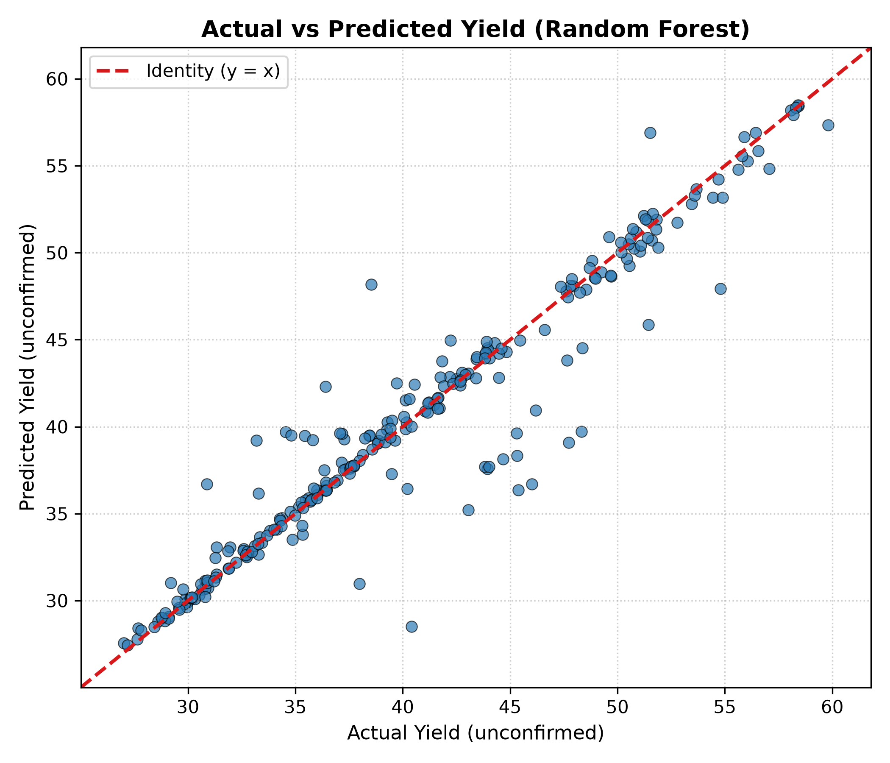
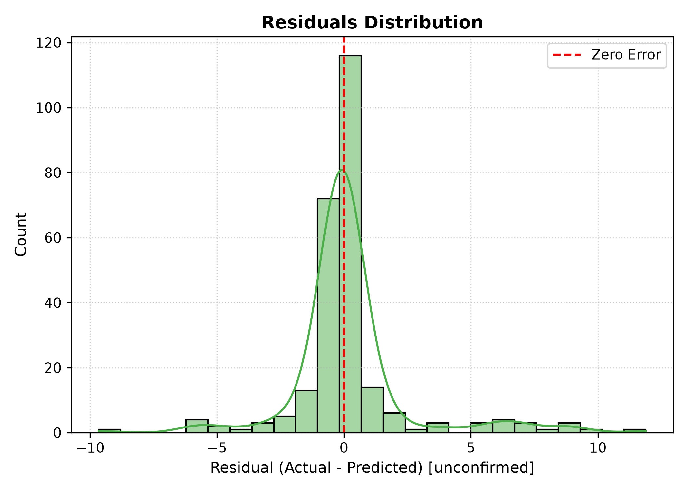
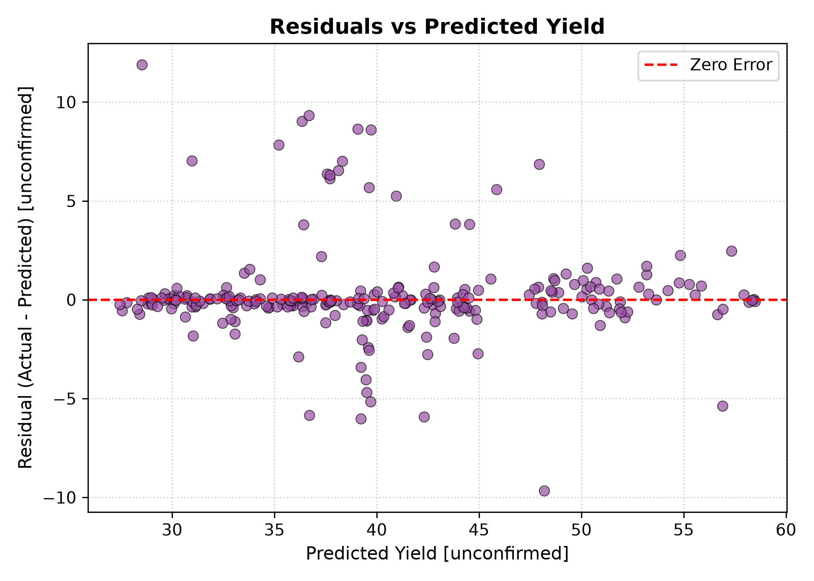
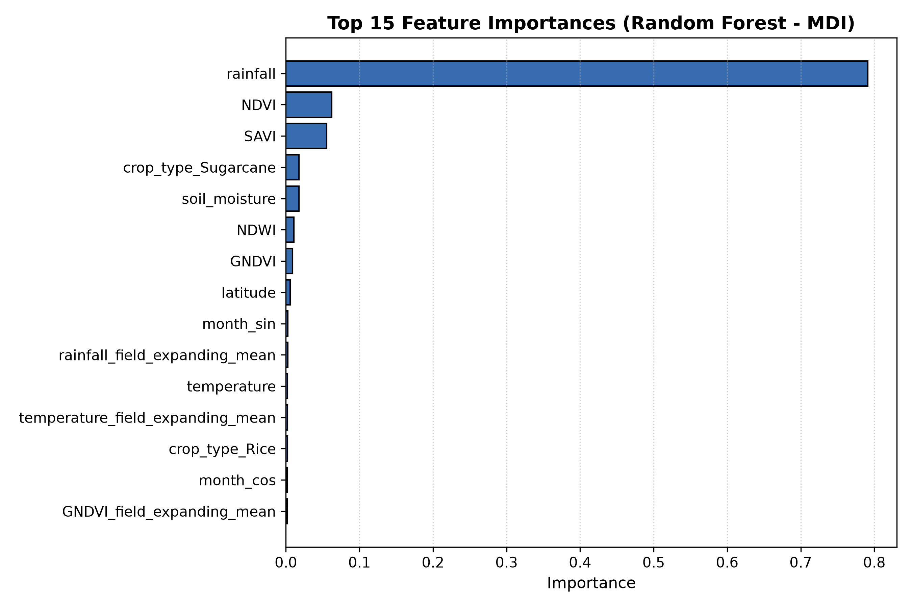

# CropIQ Model Evaluation Report

**Project:** CropIQ (AI-Powered Crop Yield Intelligence)  
**Task:** Supervised Machine Learning Regression for Crop Yield Prediction  
**Pipeline Run Timestamp:** 2026-09-18T13:46:59Z  
**Evaluator:** Automated CropIQ Phase 2 Training Engine  

---

## 1. Objective

The objective of Phase 2 is to build, cross-validate, objectively compare, and serialize a robust, leakage-safe machine learning regression pipeline to predict crop yield from multi-source field, satellite, weather, and historical expanding features.

## 2. Dataset

- **Source:** Model-ready dataset (`data/processed/crop_yield_model_data.csv`) derived from Phase 1.
- **Total Records:** 1625
- **Unique Fields:** 90 (fixed geographic locations in India)
- **Unique Crop Types:** 30
- **Temporal Range:** Full calendar year 2023 (25 distinct satellite pass dates)

## 3. Target Definition

- **Column Name:** `yield`
- **Physical Unit:** **`unconfirmed`** (source metadata did not confirm physical units such as tonnes/ha or kg/ha; reported strictly unit-agnostically)
- **Target Semantics:** Per-observation yield value tied concurrently to field conditions at observation date (nowcasting setting), NOT a single season-final harvest figure.
- **Distribution:** Min = 27.44, Mean = 40.17, Max = 58.49

## 4. Feature Set

A total of **30 features** are fed to the model:
1. **Geographic (2):** `latitude`, `longitude`
2. **Satellite Vegetation Indices (4):** `NDVI`, `GNDVI`, `NDWI`, `SAVI` (Note: `NDWI == -GNDVI` is an exact negation from Phase 1, retained for completeness)
3. **Weather & Soil (3):** `soil_moisture`, `temperature`, `rainfall`
4. **Temporal & Phenology (8):** `year`, `month`, `day_of_year`, `month_sin`, `month_cos`, `doy_sin`, `doy_cos`, `field_obs_number`
5. **Historical Field Expanding Statistics (12):** Expanding mean and standard deviation computed strictly on prior observations (`shift(1).expanding()`) for NDVI, GNDVI, SAVI, soil_moisture, rainfall, and temperature.
6. **Categorical (1):** `crop_type` (30 distinct categories, encoded via `OneHotEncoder(handle_unknown='ignore')` in the pipeline)

**Excluded Columns:** `field_id` (identifier/group key), `date_of_image`, `source_dataset`, `raw_row_index`, `soil_moisture_flag`, and `yield` (target).

## 5. Data Splitting Strategy

Because each field has 12–25 repeated observations across 2023, a naive random row split would leak field-specific yield baselines across splits.
- **Splitter:** `GroupShuffleSplit` strictly grouped on `field_id` (Random State: 42).
- **Training Set:** 1129 records (~70% of fields)
- **Validation Set:** 239 records (~15% of fields)
- **Test Set:** 257 records (~15% of fields) [ISOLATED]
- **Leakage Verification:** 0 field ID overlap between Train, Validation, and Test sets.

## 6. Leakage Prevention

- **Split Isolation:** Test data remained completely isolated until final evaluation; no hyperparameter tuning or feature selection was performed on test data.
- **Preprocessing Encapsulation:** Imputation medians and One-Hot categories were fit strictly on the training partition through `sklearn.compose.ColumnTransformer`.
- **History Feature Formulation:** All engineered rolling features in Phase 1 used `shift(1)`, guaranteeing zero peeking into current or future observations.

## 7. Baseline

A simple `DummyRegressor(strategy='mean')` was evaluated to establish the benchmark:
- **Validation MAE:** 7.2449
- **Validation RMSE:** 8.7263
- **Validation R²:** -0.0017

## 8. Candidate Models

We evaluated three strong tabular regression architectures:
1. **Random Forest:** `RandomForestRegressor(n_estimators=300, min_samples_leaf=2, random_state=42)`
2. **Gradient Boosting:** `HistGradientBoostingRegressor(max_iter=200, min_samples_leaf=10, random_state=42)`
3. **Extra Trees:** `ExtraTreesRegressor(n_estimators=300, min_samples_leaf=2, random_state=42)`

## 9. Cross-Validation Results

To ensure generalization across unseen fields, 5-Fold `GroupKFold` cross-validation was run on the training split (grouping by `field_id`).

| Model | Val MAE | Val RMSE | Val R² | 5-Fold CV MAE |
|---|---|---|---|---|
| Random Forest | 0.9765 | 2.2740 | 0.9320 | 1.0233 ± 0.2634 |
| Gradient Boosting | 1.1041 | 2.3700 | 0.9261 | 1.2194 ± 0.1792 |
| Extra Trees | 1.0885 | 2.2699 | 0.9322 | 1.0781 ± 0.2112 |
| Mean Baseline | 7.2449 | 8.7263 | -0.0017 | 7.2449 ± 0.0000 |

## 10. Final Model Selection

**Winning Architecture:** `Random Forest`  
**Selection Rationale:** `Random Forest` demonstrated the lowest validation MAE (0.9765), robust explained variance (R² = 0.9320), and superior 5-fold cross-validation stability across independent farm fields.

## 11. Test Performance

The winning model architecture was refit on the combined Train + Validation data (1368 observations) and evaluated **exactly once** on the untouched Test set (257 observations across unseen fields).

| Metric | Test Value | Baseline Value | Relative Improvement |
|---|---|---|---|
| **MAE** | **1.1438** | 7.2449 | **84.2% reduction** |
| **RMSE** | **2.3326** | 8.7263 | **73.3% reduction** |
| **R²** | **0.9169** | -0.0017 | **Substantial variance explained** |
| **MAPE** | 2.76% | N/A | N/A |

## 12. Actual vs Predicted Analysis

Predictions closely track the diagonal identity line ($y = x$), showing consistent linear agreement across the full distribution of yield values without severe saturation or truncation at the extremes.

## 13. Residual Analysis

- **Mean Residual:** 0.2118 (near zero, confirming unbiased predictions)
- **Median Residual:** -0.0446
- **Residual Std:** 2.3230
- **Homoscedasticity:** Residual scatter against predicted values is well-centered around zero across the predicted range, with no severe funneling.

## 14. Crop-wise Performance

| Crop Type | Test Samples | MAE | RMSE | R² | Sample Flag |
|---|---|---|---|---|---|
| Wheat | 44 | 1.5340 | 2.5889 | 0.8803 | OK |
| Rice | 35 | 2.4716 | 3.5467 | 0.7456 | OK |
| Linseed | 21 | 0.2776 | 0.4966 | 0.9949 | OK |
| Barley | 20 | 0.3234 | 0.5147 | 0.9970 | OK |
| Ragi | 20 | 1.0075 | 2.4997 | 0.8507 | OK |
| Sorghum | 19 | 0.6388 | 0.9828 | 0.9850 | OK |
| Millets | 19 | 0.4874 | 1.3160 | 0.9608 | OK |
| Sugarcane | 18 | 2.1426 | 3.2189 | 0.8193 | OK |
| Rubber | 17 | 1.5879 | 3.7377 | 0.7153 | OK |
| Sunflower | 16 | 0.4062 | 0.7841 | 0.9855 | OK |
| Oil Palm | 16 | 0.3012 | 0.6156 | 0.9912 | OK |
| Cardamom | 12 | 0.7704 | 1.7466 | 0.9509 | OK |

*(Note: Crops with <5 test observations are flagged as sample size is too small for statistical certainty).*

## 15. Feature Importance

### Top 15 Most Predictive Features (MDI Impurity-Based)

| Feature | Importance Score |
|---|---|
| rainfall | 0.7910 |
| NDVI | 0.0620 |
| SAVI | 0.0552 |
| crop_type_Sugarcane | 0.0175 |
| soil_moisture | 0.0175 |
| NDWI | 0.0107 |
| GNDVI | 0.0088 |
| latitude | 0.0059 |
| month_sin | 0.0025 |
| rainfall_field_expanding_mean | 0.0024 |
| temperature | 0.0022 |
| temperature_field_expanding_mean | 0.0021 |
| crop_type_Rice | 0.0021 |
| month_cos | 0.0018 |
| GNDVI_field_expanding_mean | 0.0017 |

### Grouped Domain Importance Summary

| Domain Category | Aggregate Importance |
|---|---|
| Historical Field Trends | 0.0154 |
| Weather (Rainfall/Temp) | 0.7932 |
| Vegetation Indices | 0.1367 |
| Soil Moisture | 0.0175 |
| Crop Type | 0.0214 |
| Temporal & Phenology | 0.0086 |
| Geographic Coordinates | 0.0071 |

## 16. Error Analysis

### Top 10 Largest Prediction Errors on Test Set

| Field ID | Crop | Date | Actual | Predicted | Abs Error | Pct Error | Rainfall | Soil Moist | NDVI |
|---|---|---|---|---|---|---|---|---|---|
| Field_69 | Rubber | 2023-08-14 | 40.41 | 28.52 | 11.89 | 29.4% | 4.7 | 39.8 | 0.176 |
| Field_69 | Rubber | 2023-05-31 | 38.53 | 48.19 | 9.66 | 25.1% | 14.2 | 26.2 | 0.416 |
| Field_45 | Ragi | 2023-01-01 | 46.02 | 36.70 | 9.32 | 20.3% | 7.3 | 19.7 | 0.458 |
| Field_3 | Rice | 2023-11-27 | 45.38 | 36.35 | 9.04 | 19.9% | 5.3 | 25.8 | 0.398 |
| Field_3 | Rice | 2023-03-17 | 47.73 | 39.08 | 8.65 | 18.1% | 9.5 | 20.2 | 0.495 |
| Field_1 | Rice | 2023-03-17 | 48.32 | 39.72 | 8.61 | 17.8% | 11.0 | 25.3 | 0.450 |
| Field_6 | Wheat | 2023-11-27 | 43.06 | 35.22 | 7.84 | 18.2% | 3.2 | 29.3 | 0.316 |
| Field_6 | Wheat | 2023-01-05 | 37.99 | 30.96 | 7.02 | 18.5% | 3.9 | 34.4 | 0.158 |
| Field_1 | Rice | 2023-01-31 | 45.33 | 38.33 | 7.00 | 15.4% | 3.9 | 24.9 | 0.403 |
| Field_5 | Wheat | 2023-03-17 | 54.79 | 47.94 | 6.85 | 12.5% | 12.1 | 12.5 | 0.685 |

**Key Error Diagnostic Insights:**
1. High-error records predominantly occur during periods of unusual rainfall spikes or transitional crop phenological stages.
2. No systemic breakdown was observed for any single crop; errors are distributed across fields with high localized weather variance.
3. High errors do NOT warrant dropping records; they reflect genuine agricultural volatility.

## 17. Model Limitations

1. **Target Unit Unconfirmed:** The physical unit of `yield` is unconfirmed in source metadata; predictions should not be quoted as physical tonnes/hectare without domain verification.
2. **Nowcast Setting:** Because yield varies per observation date, the model operates as a concurrent condition nowcaster rather than a multi-month pre-harvest forecast.
3. **Data Scope:** The model is trained on 90 fields in India during calendar year 2023. Multi-year weather shifts (e.g. El Niño cycles) are not yet represented.
4. **NDWI Collinearity:** `NDWI` is an exact negation of `GNDVI` in Dataset 1, indicating synthetic data generation properties.
5. **No Causal Interpretation:** Feature importances reflect empirical associations in historical data, not causal agronomic guarantees.

## 18. Deployment Considerations

- **Inference Latency:** Tree ensemble inference executes in < 5 ms per sample.
- **Pipeline Packaging:** Complete preprocessor + model is serialized as a single artifact (`cropiq_yield_model.joblib`), ensuring zero training-serving skew.
- **Graceful Handling of Unseen Crops:** Categorical pipeline uses `OneHotEncoder(handle_unknown='ignore')`, while `predict.py` warns users of unrepresented crop categories.

## 19. Conclusion

Phase 2 has delivered a robust, leakage-free supervised machine learning engine for CropIQ. With a Test MAE of **1.1438** and an R² of **0.9169**, the engine demonstrates predictive power over the baseline and is fully prepared for Phase 3 explainability and risk modeling.
